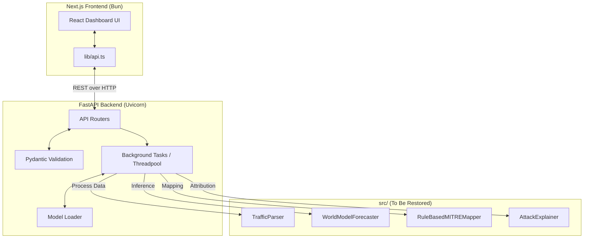
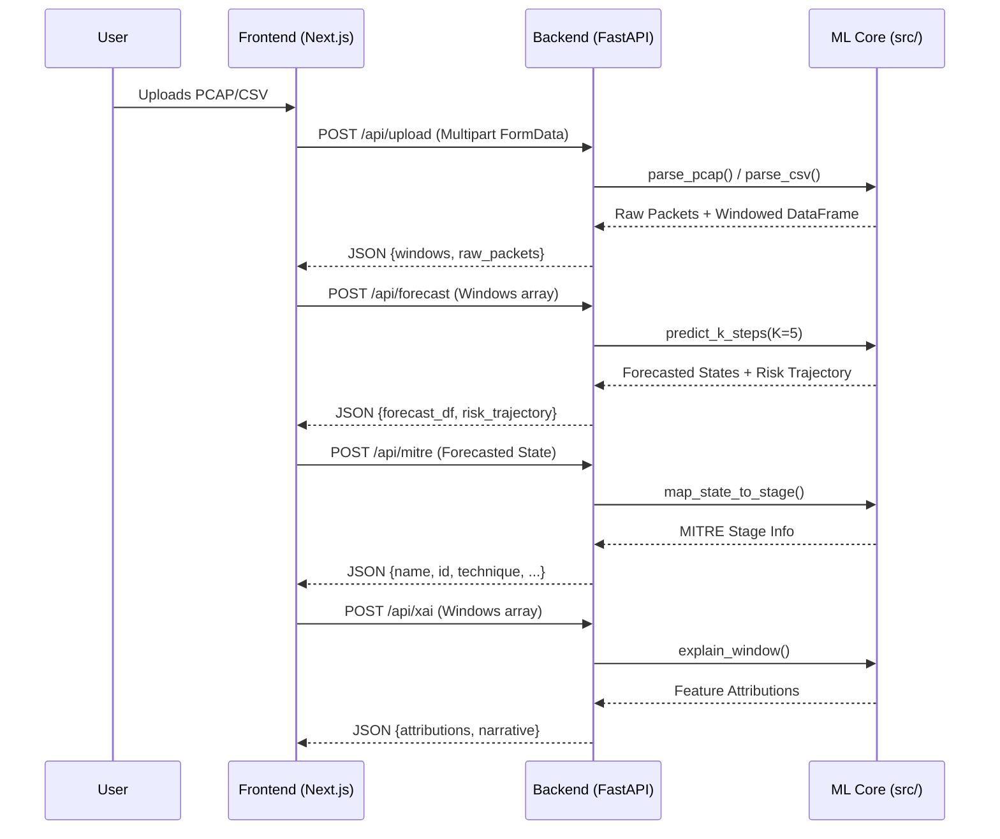

# SIH26153 — Project Inventory & Architecture (v2)

**Audit Date:** 2026-09-23

## Changelog — Re-audit (frontend/backend split + cloud training)
- **Tech Stack:** Updated to reflect FastAPI (Backend) and Next.js/Bun (Frontend).
- **Directory Tree:** Rebuilt to match the new repository structure.
- **Missing Code:** Highlighted the deleted `src/` directory which breaks the backend.
- **Data Flow:** Updated sequence diagram to show client-server communication.

---

## 1. Technology Stack

| Component | Technology | Version / Proof |
|---|---|---|
| **Frontend Framework** | Next.js | `16.3.5` (package.json) |
| **Frontend Runtime** | Bun | `1.4.2` (via `bun --version`) |
| **UI Styling** | Tailwind CSS | `^4` (package.json) |
| **Backend Framework** | FastAPI | `>=0.111.0` (backend/requirements.txt) |
| **Backend Server** | Uvicorn | `>=0.30.0` |
| **Deep Learning** | PyTorch | `>=2.0.0` |
| **Data Processing** | Pandas / NumPy | `>=2.0.0` / `>=1.24.0` |
| **Explainability** | Captum (GradientShap) | `>=0.7.0` |
| **Packet Parsing** | Scapy | `>=2.5.0` |
| **Infrastructure** | None | No Dockerfiles, no IaC found. |

---

## 2. Directory Tree (Annotated)

```text
c:\Users\karrt\.vscode\SIH26
├── backend/                        # FastAPI Backend Service
│   ├── main.py                     # Entry point (FastAPI app, CORS, routes)
│   ├── requirements.txt            # Python dependencies
│   ├── models/
│   │   └── loader.py               # ML Model loading logic (BROKEN: imports missing 'src')
│   ├── routers/                    # API Endpoints
│   │   ├── benchmark.py
│   │   ├── forecast.py
│   │   ├── mitre.py
│   │   ├── report.py
│   │   ├── scenario.py
│   │   ├── soc.py
│   │   └── upload.py               # File upload handler (BROKEN: blocks event loop)
│   └── schemas/
│       └── requests.py             # Pydantic validation models
├── frontend/                       # Next.js Frontend App
│   ├── package.json                # Bun dependencies
│   ├── bun.lock                    # Bun lockfile
│   └── src/
│       ├── app/
│       │   ├── dashboard/page.tsx  # Main dashboard layout and state orchestration
│       │   ├── globals.css         # Tailwind directives
│       │   ├── layout.tsx
│       │   └── components/         # React UI components (Tabs, Cards, Layout)
│       └── lib/
│           ├── api.ts              # API client for backend communication
│           └── types.ts            # TypeScript interfaces
├── data/                           # (Gitignored) Raw and processed datasets
├── docs/audit/                     # Auditor reports
└── src/                            # 🔴 MISSING: Entire ML core deleted in recent commits
```

---

## 3. Architecture Diagrams

### 3.1 Target System Architecture (Post-Fix)



### 3.2 Target Data Flow (Sequence)



---

## 4. Current State Gaps
1. **Missing Implementation:** The `ML Core` layer shown in the diagrams above does not currently exist in the repository.
2. **Blocking APIs:** The current backend code does not use `Worker` (Background Tasks/Threadpool) for `Parser` and `Model` operations, meaning the FastAPI event loop is blocked.
3. **Missing Config/IaC:** There is no Dockerfile, Terraform, or cloud deployment configuration present.
