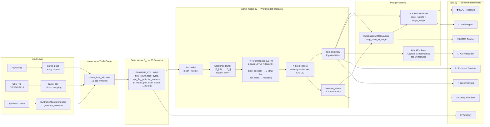
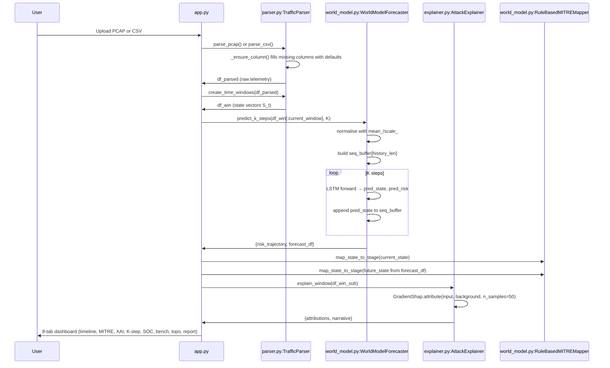

# SIH26153 — Project Inventory

**Audit Date:** 2026-09-21

---

## Overview

| Field | Value |
|---|---|
| **Project Name** | SIH26153 — AI-Based Network Attack Forecasting Engine |
| **Purpose** | Predictive cyber defense: World-Model LSTM that learns network state transition dynamics and forecasts attack escalation K steps ahead |
| **Maturity** | Late Prototype (MVP) — functional UI, trained model artifact, test suite present |
| **Primary Author** | Asachdeva001 (karrtikgupta) |
| **First Commit** | 2026-09-08 (Initial commit) |
| **Last Commit** | 2026-09-09 (change readme) |
| **Total Commits** | 8 |

---

## Tech Stack

| Layer | Technology | Version | Purpose |
|---|---|---|---|
| **Runtime** | Python | 3.12 (detected from pyc) | Application language |
| **ML Framework** | PyTorch | ≥2.0.0 | LSTM training, inference |
| **ML Utilities** | scikit-learn | ≥1.4.0 | Logistic regression baseline, metrics |
| **Data** | pandas | ≥2.0.0 | DataFrame processing, windowing |
| **Data** | numpy | ≥1.24.0 | Numerical ops |
| **Data** | scipy | ≥1.10.0 | (Imported in requirements; not directly referenced in src/) |
| **UI** | Streamlit | ≥1.30.0 | Dashboard web app |
| **Visualisation** | Plotly | ≥5.18.0 | Interactive charts |
| **PCAP parsing** | Scapy | ≥2.5.0 | Raw packet parsing |
| **Explainability** | Captum | ≥0.7.0 | GradientShap attribution |
| **Explainability** | SHAP | ≥0.44.0 | Listed in requirements but Captum is used; `shap` not imported in any source file |
| **Config** | PyYAML | ≥6.0.0 | `configs/default.yaml` loading |
| **Persistence** | joblib | ≥1.3.0 | Save/load scaler, baseline model |
| **Data Download** | kaggle | ≥1.6.0 | Dataset download API |
| **Progress** | tqdm | ≥4.65.0 | Progress bars in windowing and training |
| **Testing** | pytest | ≥7.4.0 | Unit/integration tests |
| **Deployment** | Docker | — | `Dockerfile` for containerisation |
| **Deployment** | Render.com | — | `render.yaml`, `Procfile` for cloud hosting |

---

## Annotated Directory Tree

```
SIH26153/
├── app.py                          # ACTIVE — Main Streamlit dashboard (929 lines). All 8 UI tabs. Loads model at startup.
├── README.md                       # ACTIVE — Setup instructions (160 lines). Missing expected-output screenshots.
├── Features.md                     # ACTIVE — Feature specification document (97 lines). NOT an architecture doc (R24).
├── requirements.txt                # ACTIVE — 15 dependencies. Missing: python-dotenv. Versions unpinned (>=).
├── Dockerfile                      # ACTIVE — Python 3.10-slim. Builds and runs Streamlit.
├── render.yaml                     # ACTIVE — Render.com deployment manifest (cloud hosting).
├── Procfile                        # ACTIVE — Web process start command for Render.
├── .dockerignore                   # ACTIVE — Excludes data/, .venv/, scratch/ from Docker build.
├── .gitignore                      # ACTIVE — Excludes .env, data/, .venv/. NOTE: Models gitignored but already tracked.
├── .env                            # ⚠️ DANGER — Real Kaggle API credentials committed. Should NEVER be tracked.
│
├── configs/
│   └── default.yaml                # ACTIVE — Training hyperparameters: epochs=35, lr=0.005, seed=42, history_len=4.
│
├── data/
│   └── raw/
│       └── ids-intrusion-csv/
│           └── 02-14-2018.csv      # ACTIVE (local only) — CIC-IDS-2018, 358 MB, excluded from git by .gitignore.
│
├── models/
│   ├── world_model_v1.pth          # ACTIVE — PyTorch checkpoint (258 KB). Trained on SYNTHETIC data (not real CSV).
│   ├── scaler.pkl                  # ACTIVE — Scaling parameters (mean_/scale_) from synthetic training run (502 bytes).
│   ├── baseline_lr_v1.pkl          # ACTIVE — Serialised BaselineClassifier object (synthetic training, 1.9 KB).
│   └── benchmark_report_synthetic.json # ACTIVE — Metrics from synthetic run. WM F1=0.000, LR F1=0.982.
│
├── scripts/
│   ├── train.py                    # ACTIVE — Full training pipeline: parse CSV or fall back to synthetic, split, train, benchmark.
│   └── download_dataset.py         # ACTIVE — Kaggle API download for CIC-IDS-2018 `02-14-2018.csv`.
│
├── src/
│   ├── __init__.py                 # ACTIVE — Package init (144 bytes, just comments and exports).
│   ├── parser.py                   # ACTIVE — TrafficParser (CSV + PCAP) and create_time_windows(). Core feature extraction.
│   ├── world_model.py              # ACTIVE — PyTorchTransitionLSTM, WorldModelForecaster, RuleBasedMITREMapper, SOCRiskPrioritizer, BenchmarkEvaluator.
│   ├── explainer.py                # ACTIVE — AttackExplainer using Captum GradientShap. Per-sample per-timestep attribution.
│   └── synthetic_generator.py     # ACTIVE — SyntheticAttackGenerator. 4 scenarios with hard-coded stage windows.
│
├── tests/
│   └── test_pipeline.py            # ACTIVE — 9 tests covering parser, world model, MITRE mapper, explainer, no-leakage split. ALL PASS [RUN].
│
└── docs/
    └── audit/                      # NEW (created by this audit)
```

---

## File-by-File Inventory

| Path | Type | Size | Purpose | Status |
|---|---|---|---|---|
| `app.py` | Python | 42 KB | Streamlit dashboard — UI, model loading, all 8 tabs | Active |
| `README.md` | Markdown | 9 KB | Setup & usage docs | Active (incomplete) |
| `Features.md` | Markdown | 6 KB | Feature specification | Active (≠ arch doc) |
| `requirements.txt` | Config | 232 B | Python deps (unpinned) | Active (gap: missing python-dotenv) |
| `Dockerfile` | Config | 587 B | Docker build | Active |
| `render.yaml` | Config | 382 B | Render.com cloud deploy | Active (contradicts offline R17) |
| `Procfile` | Config | 173 B | Heroku/Render process | Active |
| `.dockerignore` | Config | 102 B | Docker exclusions | Active |
| `.gitignore` | Config | 552 B | Git exclusions | Active (model rules inoperative) |
| `.env` | Secret | 80 B | Kaggle credentials — real API key committed | 🔴 DANGER |
| `configs/default.yaml` | YAML | 138 B | Training hyperparameters | Active |
| `data/raw/ids-intrusion-csv/02-14-2018.csv` | CSV | 358 MB | CIC-IDS-2018 real dataset | Active (local only, not in git) |
| `models/world_model_v1.pth` | Binary | 258 KB | Trained PyTorch LSTM checkpoint | Active (synthetic training) |
| `models/scaler.pkl` | Binary | 502 B | Scaling parameters | Active (synthetic) |
| `models/baseline_lr_v1.pkl` | Binary | 1.9 KB | Logistic regression baseline | Active (synthetic) |
| `models/benchmark_report_synthetic.json` | JSON | 1.1 KB | Benchmark results (synthetic) | Active (WM F1=0.000) |
| `scripts/train.py` | Python | 6.6 KB | Training pipeline | Active |
| `scripts/download_dataset.py` | Python | 1.1 KB | Kaggle dataset downloader | Active |
| `src/__init__.py` | Python | 144 B | Package init | Active |
| `src/parser.py` | Python | 15.8 KB | Feature extraction (CSV + PCAP) | Active |
| `src/world_model.py` | Python | 21.9 KB | All model classes + evaluator | Active |
| `src/explainer.py` | Python | 6.3 KB | Captum GradientShap XAI | Active |
| `src/synthetic_generator.py` | Python | 13.8 KB | Synthetic data generator | Active |
| `tests/test_pipeline.py` | Python | 7.7 KB | 9 test cases | Active (all pass) |

---

## Architecture Diagram



---

## End-to-End Data Flow (Upload → Outputs)


