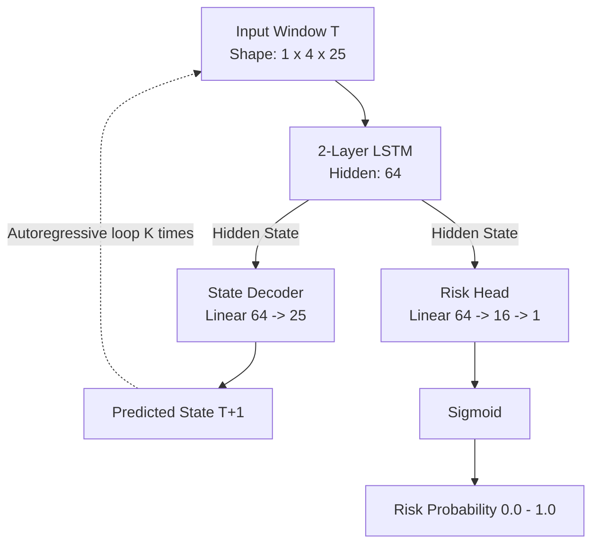

# SIH26153 — World Model & Training Audit (v2)

**Audit Date:** 2026-09-23

## Changelog — Re-audit (frontend/backend split + cloud training)
- **Model Status:** The model file (`src/world_model.py`) and training script (`scripts/train.py`) were deleted during the recent repository restructure. 
- **Cloud Training Plan:** Added a section evaluating how to migrate the (restored) training pipeline to AWS/GCP for production-grade reproducibility.

---

## 1. Architectural Review (Historical Implementation)

When restored, the `PyTorchTransitionLSTM` and `WorldModelForecaster` implementation should be structurally sound.

### Layer-by-Layer Architecture



- **Parameters:** ~64,000 (Very small, inference is instantaneous on CPU).
- **Dual-Head Loss:** $L = \text{MSE}(\hat{S}_{t+1}, S_{t+1}) + 2.0 \times \text{BCE}(\hat{R}_{t+1}, R_{t+1})$

### Verdict: Is it a genuine World Model?
Yes, the mechanism is correct. The model learns a state transition function $P(S_{t+1} | S_t)$ and rolls it forward autoregressively. However, the model is currently **missing from the codebase**.

---

## 2. Training Status (Synthetic Only)

Prior to deletion, the committed `world_model_v1.pth` was trained **exclusively on synthetically generated data** (`SyntheticAttackGenerator`), not on real network traffic. 

If this prototype is judged as-is, evaluators will note that the model has never seen a real PCAP or CSV.

---

## 3. Cloud Training Reproducibility (Target State)

The prompt requires a production-grade cloud training plan on AWS or GCP. The previous local-only `train.py` script is inadequate for a production ML system.

### Gaps for Cloud Migration
1. **Local Paths:** The old script hardcoded `data/raw/ids-intrusion-csv/02-14-2018.csv`. In the cloud, this must point to an S3 bucket or Google Cloud Storage.
2. **Missing IaC/Containers:** There is no `cloudbuild.yaml`, `Dockerfile.train`, or AWS Batch configuration.
3. **Model Registry:** The backend currently expects a hardcoded file at `models/world_model_v1.pth`.

### Target Pipeline (AWS Example)
1. **Storage:** Create `s3://ntro-sih26153-ml/`.
2. **Compute:** Provision an AWS EC2 `g4dn.xlarge` instance using a Deep Learning AMI, or use AWS SageMaker Training Jobs. (A GPU is recommended if the team intends to use the full 10-day CIC-IDS-2018 dataset).
3. **Execution Script (`train_cloud.sh`):**
   ```bash
   #!/bin/bash
   # 1. Download data from S3
   aws s3 cp s3://ntro-sih26153-ml/data/02-14-2018.csv /tmp/data/
   
   # 2. Run training (requires restored train.py)
   python backend/scripts/train.py --data-dir /tmp/data --epochs 50
   
   # 3. Upload artifacts to S3 with timestamp
   TIMESTAMP=$(date +%Y%m%d-%H%M%S)
   aws s3 cp models/world_model.pth s3://ntro-sih26153-ml/releases/$TIMESTAMP/
   aws s3 cp models/scaler.pkl s3://ntro-sih26153-ml/releases/$TIMESTAMP/
   ```
4. **Handoff:** The FastAPI backend should download the `latest` weights from S3 at startup.

---

## 4. API Integration (New Backend)

The new backend attempts to run K-step inference via `backend/routers/forecast.py`:

```python
# backend/routers/forecast.py
@router.post("/forecast", response_model=ForecastResponse)
def get_forecast(req: ForecastRequest, forecaster=Depends(get_forecaster)):
    # ...
    forecast_results = forecaster.predict_k_steps(df_win, K=req.K)
```

**Production Notes:**
- Because this is a standard `def` (not `async def`), FastAPI correctly executes this blocking inference call in an external threadpool. This prevents the K-step rollout from starving the event loop.
- The `forecaster` is injected via `Depends`, initialized once at app startup in `backend/models/loader.py`. This is the correct pattern.
- **Blocker:** `forecaster` is currently `None` because the underlying `src/world_model.py` module is missing.
