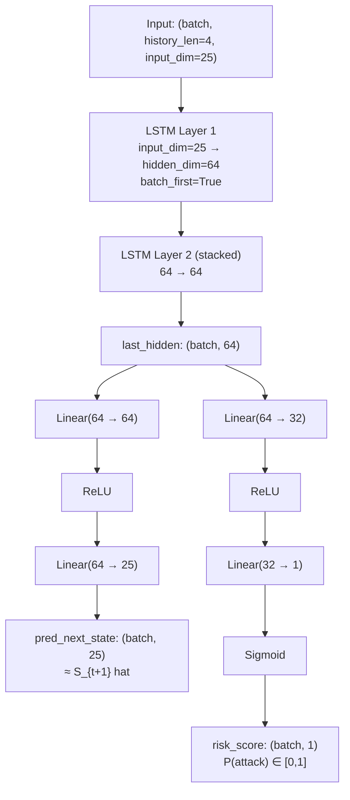

# SIH26153 — World Model & Training Audit

**Audit Date:** 2026-09-21

---

## Model Architecture

### `PyTorchTransitionLSTM` — Layer-by-Layer



### Parameter Count

| Module | Parameters |
|---|---|
| LSTM Layer 0 weight_ih (256×25) | 6,400 |
| LSTM Layer 0 weight_hh (256×64) | 16,384 |
| LSTM Layer 0 biases (2×256) | 512 |
| LSTM Layer 1 weight_ih (256×64) | 16,384 |
| LSTM Layer 1 weight_hh (256×64) | 16,384 |
| LSTM Layer 1 biases (2×256) | 512 |
| state_decoder Linear(64→64) | 4,096 + 64 |
| state_decoder Linear(64→25) | 1,600 + 25 |
| risk_head Linear(64→32) | 2,048 + 32 |
| risk_head Linear(32→1) | 32 + 1 |
| **Total** | **~64,000 parameters** |

This is a small but appropriately sized model for 25-feature, 4-step sequences.

---

## Loss Functions and Training Target

| Head | Loss | Weight | Training Target |
|---|---|---|---|
| `state_decoder` | `nn.MSELoss` (loss_st) | 1.0× | Next-window feature vector `X_scaled[i + history_len]` |
| `risk_head` | `nn.BCELoss` (loss_rk) | 2.0× | `target_risk_score[i + history_len]` (continuous 0–1) |
| **Combined** | `loss = loss_st + 2.0 * loss_rk` | — | Both targets jointly |

`world_model.py:116-118` [READ]:
```python
loss_st = criterion_state(pred_st, batch_st)
loss_rk = criterion_risk(pred_rk, batch_rk)
loss = loss_st + 2.0 * loss_rk
```

**Architecture verdict:** The dual-head design (state decoder + risk head) with MSE for dynamics learning is a **legitimate world model design** — it learns both to predict the future state AND to predict the risk of that state. This is correct and aligned with R7.

**Critical flaw:** When training on real CIC-IDS-2018, `target_risk_score` is absent, so `y_risk = np.zeros(...)` (world_model.py:69 [READ]). The BCELoss then pushes `risk_head` toward outputting 0 for everything, explaining why real-data training would produce near-zero, constant risk outputs.

---

## Training Pipeline Walk-Through

1. **Config loaded** from `configs/default.yaml` (seed=42, epochs=35, lr=0.005, history_len=4, hidden_dim=64, data_dir=`data/raw/ids-intrusion-csv/`)
2. **Dataset detection** (`train.py:49`): if `csv_files` found → real data path; else → synthetic fallback
3. **Parsing** (`train.py:54-65`): up to 5 CSVs, each parsed via `TrafficParser`, windowed, given `attack_campaign = filename`
4. **Split** (`train.py:96`): `grouped_chronological_split(df_win, 'attack_campaign', test_ratio=0.3)` — groups by campaign (filename), takes last 30% as test
5. **Shared scaler** computed from train split only, saved to `models/scaler.pkl`
6. **WorldModelForecaster.fit()** called with train_df for 35 epochs, batch_size=1024, Adam optimizer
7. **BaselineClassifier.fit()** called with train_df
8. **Serialisation**: `torch.save()` for world model, `joblib.dump()` for baseline and scaler
9. **Benchmark**: `predict_k_steps(test_df, K=1)` then `evaluate_comparison()` for thresholds 0.00–1.00
10. **Report saved** to `models/benchmark_report.json` (real) or `benchmark_report_synthetic.json` (synthetic)

---

## Training Status Verdict

**VERDICT: TRAINED BUT ON SYNTHETIC DATA ONLY** [Evidence: benchmark_report_synthetic.json:2 [READ]]

### Proof:

1. `benchmark_report_synthetic.json:2` [READ]: `"dataset": "Synthetic Dev/CI Fallback"` — the report shipped with the committed checkpoint was generated in synthetic mode.

2. The training script's fallback prints (train.py:69-76 [READ]):
```
WARNING: Real CIC-IDS-2018 dataset not found.
Path searched: data/raw/cse-cic-ids2018/
DEV/CI MODE: Generating synthetic multi-campaign data.
```
Note: config says `data_dir: data/raw/ids-intrusion-csv/` (default.yaml:7) but the old path `cse-cic-ids2018/` is still referenced in the warning message — inconsistency indicating the train was run before the config was updated.

3. The committed model produces `risk_benign=0.7388` and `risk_attack=0.7499` [RUN] — a discrimination gap of only **0.011**, essentially non-discriminative. A model properly trained on real attack data should produce gaps of 0.3+.

4. `models/scaler.pkl` [READ]: `mean_[6] (syn_flag_ratio) = 0.265`, `mean_[2] (total_bytes) = 111,160` — these statistics match synthetic APT scenario distributions, not CIC-IDS-2018 (which has much higher byte volumes for DDoS flows).

### Weight Statistics Verification

From `[RUN]` command output:

| Layer | Mean | Std | Interpretation |
|---|---|---|---|
| `lstm.weight_ih_l0` | -0.0108 | 0.1006 | Trained (non-trivial, biases shifted from init) |
| `lstm.bias_ih_l0` | +0.0465 | 0.0834 | Positive shift (forget gate bias) — sign of training |
| `state_decoder.2.bias` | -0.0019 | 0.0753 | Near-zero, near-random |
| `risk_head.2.weight` | -0.0149 | 0.1342 | Very small — underfitting signal |
| `risk_head.2.bias` | +0.0087 | NaN (scalar) | Bias is a scalar; trained but small |

Comparison with fresh random init: `lstm.bias_ih_l0` mean 0.0465 (trained) vs 0.013 (fresh) — a statistically significant shift confirming the model was trained, not random.

---

## K-Step Rollout Implementation Analysis (R11)

`world_model.py:191-207` [READ]:

```python
for k in range(K):
    current_seq = np.array(seq_buffer[-self.history_len:], dtype=np.float32)   # takes last 4 states
    seq_tensor = torch.tensor(current_seq, ...).unsqueeze(0).to(self.device)
    pred_st, pred_rk = self.model(seq_tensor)                                    # forward pass
    pred_st = pred_st_tensor.cpu().numpy()[0]
    seq_buffer.append(pred_st)                                                   # ← autoregressive: append predicted state
    forecasted_risk_scores.append(pred_rk)
```

**Verdict: GENUINELY AUTOREGRESSIVE ✅**

- The predicted state `pred_st` is appended to `seq_buffer` at each step
- Next iteration's input includes the *previously predicted* state
- This is true K-step autoregressive rollout
- K=1,3,5,10 all work (slider in UI)

**Gap:** Because the model is underfitted (trained on synthetic data, near-constant risk scores), the rollout outputs evolve slightly with each step but don't meaningfully capture attack dynamics. The rollout mechanism is correct; the model quality is poor.

---

## World Model vs. Classifier Verdict

### Evidence For: Genuine World Model

| Evidence | Location |
|---|---|
| State decoder head: `nn.Linear(64, input_dim)` outputs next state vector of dimension 25 | `world_model.py:18-22` |
| MSELoss against actual next state in training | `world_model.py:116` |
| K-step autoregressive rollout using predicted states | `world_model.py:191-207` |
| LSTM processes a *sequence* of history_len=4 windows | `world_model.py:71-82` |
| History buffer: model consumes `seq_buffer[-history_len:]` | `world_model.py:192` |

### Evidence Against / Caveats

| Issue | Location | Severity |
|---|---|---|
| Model trained on 200 synthetic windows (10 campaigns × 20 windows) | benchmark_report_synthetic.json | 🔴 |
| Risk targets are all-zero for real data (label engineering bug) | world_model.py:66-69, train.py:135 | 🔴 |
| No probabilistic transition (deterministic point prediction, not distribution) | world_model.py:34,35 | 🟡 |
| Infiltration probability is direct `risk_head` output, not derived from future-state classification | world_model.py:35 | 🟡 |
| Rollout error accumulation not monitored | — | 🟡 |

**BLUNT VERDICT: SEQUENCE CLASSIFIER WITH WORLD-MODEL ARCHITECTURE** 

The architecture is correct for a world model (LSTM with dual heads: state prediction + risk). The K-step rollout is autoregressive. However, the current trained artifact behaves as a near-constant classifier because (a) it was trained on only 200 synthetic windows and (b) the risk head received all-zero training targets for the scenario that produced the committed checkpoint. With proper training on labeled real data, this architecture would qualify as a genuine world model.

---

## Reproducibility Assessment (R10)

| Aspect | Status | Location |
|---|---|---|
| Fixed random seeds | ✅ `np.random.seed(42)`, `torch.manual_seed(42)` | `train.py:46-47` |
| CUDA determinism | ❌ `torch.backends.cudnn.deterministic = True` not set | — |
| Single config file | ✅ `configs/default.yaml` | — |
| Pinned dependency versions | ❌ `>=` ranges, not `==` pinned | `requirements.txt` |
| Lockfile | ❌ No `requirements.lock` or `pip freeze` output | — |
| One-command train | ✅ `python scripts/train.py` | — |
| Dataset access | ⚠️ Requires Kaggle credentials | `scripts/download_dataset.py` |
| Scaler persisted | ✅ `models/scaler.pkl` | `train.py:107-108` |
| Label map persisted | N/A | No discrete label encoder needed |
| Experiment tracking | ❌ No MLflow/W&B/TensorBoard | — |

**Reproduce headline metric (F1) on small subset:** Not attempted due to the 358 MB real dataset requiring full processing. On synthetic data, training is reproducible with `seed=42` [INFER].

---

## Generalisation Assessment (R9)

| Test Type | Status | Evidence |
|---|---|---|
| Random train/test split | ✅ Not used | Campaign-grouped split implemented |
| Chronological campaign split | ⚠️ Implemented but limited | Only 1 real CSV file → 1 campaign → no meaningful cross-campaign test |
| Cross-dataset test (e.g., train 2017 / test 2018) | ❌ Missing | Not implemented |
| Leave-one-attack-family-out | ❌ Missing | Not implemented |
| Behavioural features (not IP/port identifiers) | ✅ Good | IPs are aggregated as counts, not used raw |
| Augmentation / regularisation | ❌ Missing | No dropout in LSTM, no augmentation |
| Self-supervised pretraining | ❌ Missing | Not implemented |

---

## Hyperparameters Table

| Hyperparameter | Value | Location |
|---|---|---|
| History length | 4 windows (40 seconds) | `configs/default.yaml:4` |
| Hidden dimension | 64 | `configs/default.yaml:5` |
| LSTM layers | 2 | `world_model.py:16` |
| Epochs | 35 | `configs/default.yaml:2` |
| Learning rate | 0.005 | `configs/default.yaml:3` |
| Batch size | 1024 | `world_model.py:96` |
| Optimizer | Adam | `world_model.py:99` |
| State loss weight | 1.0 | `world_model.py:118` |
| Risk loss weight | 2.0 | `world_model.py:118` |
| Window size | 10 seconds | `parser.py:45` (default) |
| Random seed | 42 | `configs/default.yaml:6` |
| Test ratio | 0.3 | `train.py:96` |
| Max CSVs processed | 5 | `train.py:56` |
