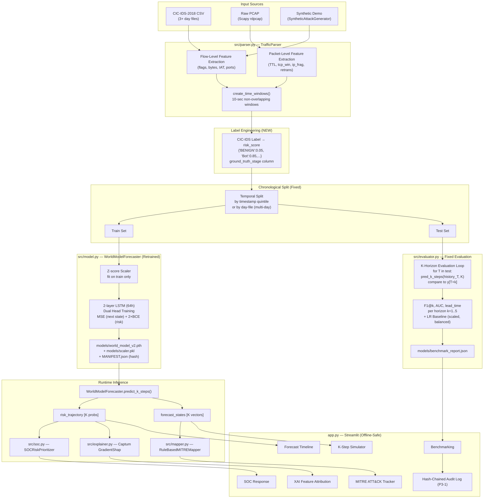

# SIH26153 — Prioritised Action Plan

**Audit Date:** 2026-09-21  
**Purpose:** Roadmap to deliver the best possible SIH Grand Finale submission, ordered by impact.

---

## P0 — BLOCKERS (Fix Before Demo)

| ID | What | Why (Requirement IDs) | Where (Files) | How | Acceptance Criteria | Effort | Depends On |
|---|---|---|---|---|---|---|---|
| **P0-1** | **Fix label engineering for real CIC-IDS-2018** — implement `Label` column → `target_risk_score` mapping | R8, R19 — without this, risk head trains on all-zeros → model is non-discriminative | `scripts/train.py:135`, `src/world_model.py:66-69` | Add label-to-risk dict: `{'BENIGN': 0.05, 'Bot': 0.85, 'DoS attacks-GoldenEye': 0.50, ...}`. Map CIC-IDS-2018 label column after parse_csv. | Model outputs risk > 0.6 for attack windows and < 0.3 for benign windows on held-out test | M (2 days) | — |
| **P0-2** | **Fix train/test split for single-CSV scenario** — campaign-grouped split collapses with 1 file | R8, R9 — broken split produces empty training set | `scripts/train.py:18-32, 96` | For a single CSV: implement within-file temporal split by timestamp quintile (first 70% as train, last 30% as test). Alternatively, download 3+ day CSVs. | `len(train_df) > 0` and `len(test_df) > 0` when training on 1 CSV | S (0.5 day) | — |
| **P0-3** | **Retrain world model on real CIC-IDS-2018 data** — committed checkpoint is synthetic-only | R1, R7, R8, R10 — synthetic model has F1=0.000 | `models/world_model_v1.pth`, `models/scaler.pkl`, `models/benchmark_report_synthetic.json` | After P0-1 and P0-2: `python scripts/train.py`. Commit new model files. | `benchmark_report.json` exists with WM F1 > 0.5 on real test split | M (3 days incl. P0-1,P0-2) | P0-1, P0-2 |
| **P0-4** | **Fix broken benchmark evaluation methodology** — padding WM probs with zeros inflates FP | R18, R19 — WM F1=0.000 is a fabricated failure | `scripts/train.py:134-149` | For each window T in test set: run `predict_k_steps(history_T, K=1)` and compare to `y_test[T+1]`. See evaluation protocol in `05_EVALUATION_AND_BENCHMARKS.md`. | WM produces a non-zero F1 score vs LR baseline on same split | M (1 day) | P0-1, P0-2 |
| **P0-5** | **Fix hard-coded 3.5 in benchmark bar chart** — fabricated metric | R19 — inflates perceived lead-time advantage | `app.py:856` | Replace `y=[..., 3.5]` with `bench_res['world_model']['lead_time_windows']` | Bar height reflects actual computed lead time | S (30 min) | P0-4 |
| **P0-6** | **Remove Google Fonts CDN dependency** — violates offline requirement | R17 | `app.py:26` | Option A (fastest): Delete the `@import url(...)` line; replace Orbitron with `monospace` fallback. Option B (best): Download `.woff2` files, embed as base64 in the CSS `@font-face` block. | App loads and renders correctly with network completely disabled | S (2 hours) | — |
| **P0-7** | **Rotate Kaggle API key committed in `.env`** — live secret exposure | Security | `.env:1-2`, `.gitignore:48` | 1. Go to kaggle.com/settings/api, revoke and regenerate key. 2. Run `git rm --cached .env`. 3. Add new credentials to `.env` (already gitignored, just untrack). 4. Create `.env.example` with placeholder values. | `git log --all -p | grep KGAT` shows old key in history → force-push or use `git filter-repo` to remove. | S (1 hour) | — |
| **P0-8** | **Add error handling for empty/malformed file uploads** — crashes on empty DF | R15 — interface crashes on edge cases | `app.py:393-414, 472` | Wrap `parse_csv/parse_pcap` in try/except. Add guard `if df_win.empty: st.error("Could not extract windows from file."); st.stop()` before `iloc[-1]`. | App shows user-friendly error message for empty, wrong-format, and corrupt files | S (2 hours) | — |

---

## P1 — HIGH (Evaluation Rigour & Demo Reliability)

| ID | What | Why | Where | How | Acceptance Criteria | Effort | Depends On |
|---|---|---|---|---|---|---|---|
| **P1-1** | **Implement proper K-horizon evaluation metrics** | R12, R19 — demonstrate temporal advantage at each horizon | `scripts/train.py` | Add per-horizon F1/AUC loop (see protocol in doc 05). Report F1@k for k=1..5. | Benchmark report contains `"f1_by_horizon": {"1": 0.xx, ..., "5": 0.xx}` | M (1 day) | P0-3, P0-4 |
| **P1-2** | **Implement CIC-IDS-2018 label → MITRE stage mapping** | R13, R8 — stage labels needed for evaluation | `scripts/train.py`, `src/parser.py` | Map CIC-IDS-2018 attack labels to 5 kill-chain stages. Store as `ground_truth_stage` column. Train a stage classification head (or use rule-based mapper + evaluate quantitatively). | Stage accuracy metric in benchmark report. Stage confusion matrix shown in app. | M (2 days) | P0-1 |
| **P1-3** | **Compute real lead-time metric** | R19 — core differentiator claim | `scripts/train.py`, `app.py` | After fixing evaluation (P0-4): compute `BenchmarkEvaluator.compute_lead_time()` on actual K-step rollout vs LR baseline on sequential test windows. | Lead time is computed (may be positive, zero, or negative — be honest). Report in `benchmark_report.json`. | M (1 day) | P0-4 |
| **P1-4** | **Implement honest packet-level feature documentation** | R4, R5 — currently silently zero-filled | `src/parser.py`, docs | Add `data_source` column to state vector: `'pcap'` or `'csv'`. For CSV mode, set `ttl_mean=NaN, tcp_window_mean=NaN, ip_frag_ratio=NaN, retrans_ratio=NaN` and exclude from model (or impute from training distribution). Show warning in UI when packet-level features are not available. | UI shows badge "⚠️ Packet-level features unavailable (CSV input — PCAP required for TTL/window/frag/retrans)" | S (3 hours) | — |
| **P1-5** | **Add PCAP retransmission detection** | R4 — retrans_count is hardcoded 0 | `src/parser.py:183` | Implement per-flow TCP state machine: track SYN, SYN-ACK, duplicate ACK sequences to count retransmissions. Or use Scapy's `TCP` flags to detect RST after data (simple heuristic). | `retrans_ratio > 0` for a PCAP with known retransmissions | M (2 days) | — |
| **P1-6** | **Add per-sample SHAP sanity check (feature ablation)** | R14 — make explainability defensible | `src/explainer.py`, `tests/test_pipeline.py` | After explaining a window, zero the top-1 feature and re-run inference. Assert risk drops. Add as a test case. | `test_shap_ablation`: risk with top feature zeroed < original risk (for attack window) | S (1 day) | P0-3 |
| **P1-7** | **Download and test on 3+ CIC-IDS-2018 day CSVs** | R1, R9 — multi-day data enables proper cross-day evaluation | `scripts/download_dataset.py`, `scripts/train.py` | Update `download_dataset.py` to download multiple day files. Update `train.py` to process all CSVs with campaign-grouped split by filename. | Training uses ≥3 day CSVs. Cross-day split is chronological. Benchmark report shows real multi-day results. | M (1 day) | P0-2 |
| **P1-8** | **Create architecture document (R24)** | R24 — submission deliverable entirely missing | `docs/architecture.md` | Write ≤2 page doc: data flow diagram (Mermaid), model diagram (layer-by-layer), feature table, ATT&CK mapping table, deployment view. See outline in doc 10. | File exists, ≤2 pages A4 equivalent, covers all required elements. | S (0.5 day) | — |
| **P1-9** | **Record 2-minute demo video (R25)** | R25 — submission deliverable entirely missing | — | Record screen capture per script in this doc's appendix. Upload to YouTube (unlisted) or GitHub Releases. Add link to README. | Video exists, ≤2 min, covers all required scenes. | S (0.5 day) | P0-3, P0-6 (UI fixed) |
| **P1-10** | **Create 5-slide presentation (R26)** | R26 — submission deliverable entirely missing | `docs/presentation.pptx` | Use slide outline in this doc's appendix. Export as PDF. | Slides exist, ≤5 slides, cover all required elements. | S (0.5 day) | — |

---

## P2 — MEDIUM (Robustness, Quality, CI)

| ID | What | Why | Where | How | Acceptance Criteria | Effort | Depends On |
|---|---|---|---|---|---|---|---|
| **P2-1** | **Add CI pipeline** | R10 — no automated test enforcement | `.github/workflows/test.yml` | `pytest tests/ -v` on every push. | GitHub Actions badge shows passing. | S (0.5 day) | — |
| **P2-2** | **Pin dependency versions** | R23 — unpinned versions break clean installs | `requirements.txt` | Run `pip freeze > requirements.lock`. Add `python-dotenv` and remove `shap` (unused). Optionally update README to mention lockfile. | `pip install -r requirements.lock` succeeds on clean venv. | S (1 hour) | — |
| **P2-3** | **Add `.streamlit/config.toml`** | R17 — disable Streamlit telemetry | `.streamlit/config.toml` | `[browser]\ngatherUsageStats = false` | Streamlit does not make telemetry calls. | S (5 min) | — |
| **P2-4** | **Fix scaler double-application in app.py** | Production robustness | `app.py:314-316` | Remove the scaler override after `load_model()` — the `.pth` already contains `mean_`/`scale_`. The `scaler.pkl` re-load overwrites correctly identical values but is fragile. | Removed. Tests pass. No change in inference output. | S (15 min) | — |
| **P2-5** | **Refactor `world_model.py` into separate modules** | Code quality | `src/world_model.py` | Split into: `src/model.py` (PyTorchTransitionLSTM, WorldModelForecaster), `src/mapper.py` (RuleBasedMITREMapper), `src/soc.py` (AssetCriticalityManager, SOCRiskPrioritizer), `src/evaluator.py` (BaselineClassifier, BenchmarkEvaluator) | All imports updated. Tests pass. | M (1 day) | — |
| **P2-6** | **Add Docker non-root user** | Security | `Dockerfile` | Add `RUN useradd -r appuser && USER appuser` before `EXPOSE` | `docker run` process is not root. | S (5 min) | — |
| **P2-7** | **Fix deprecated `fillna(method='ffill')` in parser.py** | Code quality, Python 3.12+ | `parser.py:73` | Change to `df['timestamp_dt'] = df['timestamp_dt'].ffill()` | No DeprecationWarning from pandas. | S (5 min) | — |
| **P2-8** | **Add `python-dotenv` to requirements.txt** | R23 — setup instructions fail | `requirements.txt` | Add `python-dotenv>=1.0.0` | `python scripts/download_dataset.py` works from clean install. | S (5 min) | — |
| **P2-9** | **Change `torch.load` to `weights_only=True`** | Security | `src/world_model.py:148` | The checkpoint contains numpy arrays in `mean_` and `scale_` — use `weights_only=False` but validate file path is within `models/` | `torch.load(..., weights_only=False)` restricted to trusted `models/` directory. Never on user-uploaded files. | S (1 hour) | — |
| **P2-10** | **Add class_weight='balanced' to LR baseline** | R18 — fair baseline comparison | `src/world_model.py:396` | `LogisticRegression(max_iter=1000, class_weight='balanced')` | LR baseline F1 changes (should drop on imbalanced real data, proving WM advantage). | S (5 min) | P0-3 |
| **P2-11** | **Add feature scaling to LR baseline** | R18 — fair comparison | `src/world_model.py:400-404` | Apply `mean_`/`scale_` to X before LR fit, matching WM preprocessing. | LR uses same z-scored features as WM. | S (15 min) | P0-3 |

---

## P3 — DIFFERENTIATORS / Nice-to-Have

| ID | What | Why | Where | How | Acceptance Criteria | Effort | Depends On |
|---|---|---|---|---|---|---|---|
| **P3-1** | **Hash-chained tamper-evident prediction audit log** | Theme (Blockchain & Cybersecurity), R20 | `app.py:Tab 8` | SHA-256 chain each prediction event. Store in append-only JSON log. Export log with verification tool. | Log is produced per session. Independent verification script checks chain integrity. | S (1 day) | — |
| **P3-2** | **STIX 2.1 alert export** | R20 CII applicability | `app.py:Tab 8` | Use `stix2` library to produce a STIX Bundle with Indicator and Sighting objects. Exportable as JSON. | Download button produces valid STIX 2.1 JSON. | M (2 days) | — |
| **P3-3** | **Monte Carlo Dropout uncertainty estimates** | R12 — no confidence interval on forecast | `src/world_model.py:31-36` | Add `nn.Dropout(0.1)` to LSTM. Enable dropout at inference time. Run N forward passes (e.g., 20) and compute mean ± std of risk scores per K step. | Forecast chart shows error bands. | M (1 day) | P0-3 |
| **P3-4** | **Streaming inference (sliding window)** | R20 — near-real-time production use | `src/parser.py` | Add `parse_pcap_streaming()` using Scapy's `sniff()` with `prn` callback. Buffer packets per window, compute features, run inference every 10 seconds. | Demo shows live risk score updating from a looped PCAP file. | L (3 days) | P0-3 |
| **P3-5** | **Cross-dataset generalisation test (CTU-13)** | R9 — prove generalisation | `scripts/` | Download CTU-13 scenario 1 CSV. Verify `_ensure_column` mappings. Run evaluation. Report F1 gap (trained on CIC-IDS, tested on CTU-13). | `benchmark_report_ctu13.json` exists with honest F1 values. | M (2 days) | P0-3, P1-7 |
| **P3-6** | **Model card** | R10, R20 | `docs/model_card.md` | Document: training data, evaluation metrics, intended use, limitations, biases, known failure modes. | File exists and is complete. | S (0.5 day) | P0-3 |
| **P3-7** | **Signed model artifact (hash manifest)** | Theme (Blockchain), Security | `models/MANIFEST.json` | At save time: SHA-256 hash of `.pth` file. At load time: verify hash. | Load raises error if model is tampered. | S (0.5 day) | P0-3 |

---

## Proposed Target Architecture (After P0+P1 Fixes)



---

## Minimum Winning Path (Hackathon Timeline: 72 hours)

### Hour 0–8: P0 Fixes
1. P0-7: Rotate Kaggle key (30 min)
2. P0-6: Remove Google Fonts CDN (15 min)
3. P0-8: Add upload error handling (2 hours)
4. P0-5: Fix hard-coded 3.5 bar chart (30 min)
5. P0-1: Implement CIC-IDS label → risk_score mapping (3 hours)
6. P0-2: Fix single-CSV split (1 hour)

### Hour 8–24: Training & Evaluation
7. P0-3: Retrain on real CIC-IDS-2018 (may take 1-2 hours of compute + 2 hours validation)
8. P0-4: Fix evaluation methodology (3 hours)
9. P1-3: Compute real lead-time metric (2 hours)

### Hour 24–48: P1 Deliverables
10. P1-4: Add packet-level feature warning in UI (1 hour)
11. P1-8: Write architecture doc (4 hours)
12. P1-9: Record demo video (2 hours)
13. P1-10: Create 5-slide deck (3 hours)
14. P2-1: Add CI pipeline (2 hours)
15. P2-2: Pin dependencies (1 hour)

### Hour 48–72: Differentiators
16. P3-1: Hash-chained audit log (1 day)
17. P1-6: SHAP ablation test (half-day)
18. P3-3: Uncertainty estimates (1 day)

---

## Definition of Done Checklist (R1–R26)

```
□ R1: Real CIC-IDS-2018 data loaded successfully (benchmark_report.json exists)
□ R2: Timestamped normalised feature matrix produced (25 FEATURE_COLUMNS + window metadata)
□ R3: All flow-level features including bidirectional ratios computed
□ R4: Packet-level features genuine for PCAP; clearly labeled as "unavailable" for CSV
□ R5: Both levels in model input; honest documentation of limitations
□ R6: 10-second global time windows producing S_t state vectors
□ R7: LSTM with dual head (state decoder + risk head) trained, risk scores discriminative (gap > 0.3)
□ R8: CIC-IDS-2018 label → risk_score mapping implemented; model trained on labeled real data
□ R9: At least chronological within-day test; ideally cross-day or cross-dataset
□ R10: Weights committed, config in default.yaml, seed fixed, one-command train works
□ R11: K-step autoregressive rollout produces K distinct risk values
□ R12: Risk time-series chart shown in UI for each K step
□ R13: MITRE stage from forecasted future state shown; rule-based nature disclosed
□ R14: Captum GradientShap per-sample attributions shown in XAI tab; feature ablation test passes
□ R15: UI accepts PCAP and CSV, handles errors gracefully
□ R16: Timeline, flagged flows, ATT&CK stages all shown in respective tabs
□ R17: No CDN calls; app runs fully offline; Streamlit telemetry disabled
□ R18: F1, precision, recall, FPR for WM and LR baseline on same split (real data)
□ R19: WM shows measurable F1 or lead-time improvement over LR baseline
□ R20: Asset criticality, SOC playbooks, JSON audit log; STIX export optional
□ R21: All open-source licences, Scapy GPL-2 noted in README
□ R22: GitHub repo clean history, no secrets, .gitignore active for .env
□ R23: README: exact commands work from clean clone; screenshots included
□ R24: docs/architecture.md ≤2 pages with Mermaid diagrams
□ R25: Demo video ≤2 min linked in README
□ R26: 5-slide deck PDF in repo or linked
```

---

## 2-Minute Demo Script

| Time | Scene | Action | Key Talking Point |
|---|---|---|---|
| 0:00–0:15 | App launch + header | Show dashboard loading; point to "LIVE TELEMETRY" badge | "Fully offline — no cloud API, runs on any laptop or air-gapped server" |
| 0:15–0:30 | Upload real PCAP/CSV | Drag a CIC-IDS PCAP sample into the sidebar uploader | "Dual input: raw packets or NetFlow-style CSVs from any network sensor" |
| 0:30–0:55 | Forecast Timeline tab | Move the K-step slider from 1 to 5; show risk trajectory diverging | "Our LSTM world model rolls out 5 time steps ahead — detecting attack escalation before it completes" |
| 0:55–1:10 | MITRE ATT&CK Tracker | Show stage progression from Reconnaissance → Initial Access → [Forecasted] Lateral Movement | "We don't just detect; we predict where the kill-chain is going next" |
| 1:10–1:30 | XAI tab | Point to top feature (e.g., `port_scan_score`, `iat_variance`) in SHAP bar chart + narrative | "GradientShap tells the SOC analyst *why* — not a black box" |
| 1:30–1:45 | Benchmarking tab | Show WM vs LR baseline F1 and lead-time advantage | "Temporal dynamics learning gives us N windows of early warning vs. a static classifier" |
| 1:45–2:00 | SOC Response tab | Show P1-CRITICAL alert, playbook actions; click "Isolate Host" button | "Actionable — one click dispatches isolation or micro-segmentation playbook to the SOC team" |

---

## 5-Slide Presentation Outline

### Slide 1 — The Problem: Why Static IDS Fails
- Traditional IDS: classifies each flow in isolation → no kill-chain awareness
- Attack kill-chain is temporal: Recon → Initial Access → Lateral Movement → C2 → Exfiltration
- By the time you detect C2, data is already leaving
- **Ask:** Can we forecast attack progression *before* compromise completes?

### Slide 2 — World Model Approach & Architecture
- P(S_{t+1} | S_t): Learn network state transition dynamics
- Architecture: 2-layer LSTM → dual head (state decoder + risk head)
- K-step autoregressive rollout: project attack trajectory N windows ahead
- Mermaid diagram from doc 02

### Slide 3 — Features & Data
- 25 features: TCP flags, IAT, TTL, port-scan score, IAT variance, byte volumes
- Dual-level: Flow features (CIC-IDS CSV) + Packet features (PCAP via Scapy)
- Dataset: CIC-IDS-2018 (real enterprise traffic + 15 attack types)
- Feature table with R3/R4 coverage matrix

### Slide 4 — Results vs Baseline
- WM F1 vs LR F1 (real data benchmark table)
- Lead-time advantage: WM alerts N windows before LR
- GradientShap: top 3 driving features for a representative attack window
- Honest gap: rule-based ATT&CK stage mapping; ongoing work to learn stage classifier

### Slide 5 — Demo, CII Applicability & Roadmap
- Screenshot of 3 key UI tabs (Timeline, MITRE, XAI)
- CII: Tier 1/2/3 asset criticality, SLA response, SOC playbooks
- Theme: Hash-chained tamper-evident audit log (blockchain application)
- Roadmap: STIX export, streaming inference, CTU-13 cross-dataset validation

---

## Architecture Document Outline (≤ 2 Pages)

### Page 1
**Title:** SIH26153 — AI Network Attack Forecasting Engine: Architecture

**Section 1: System Overview** (3 sentences)

**Section 2: Data Flow Diagram** (Mermaid flowchart, half page)
- Input → Parse → Window → Train → Predict → Map → Explain → UI

**Section 3: Feature Table** (compact table)
- Feature | Level (flow/packet) | Source column | Notes

### Page 2
**Section 4: World Model Architecture** (compact Mermaid diagram)
- Input tensor → LSTM → state_decoder / risk_head

**Section 5: ATT&CK Mapping** (small table)
- Stage | Rule | Technique ID

**Section 6: Deployment View** (bullet list)
- Local: `streamlit run app.py`
- Docker: `docker build -t sih26153 . && docker run -p 8501:8501`
- Air-gapped: all models bundled; no internet required (after font fix)
