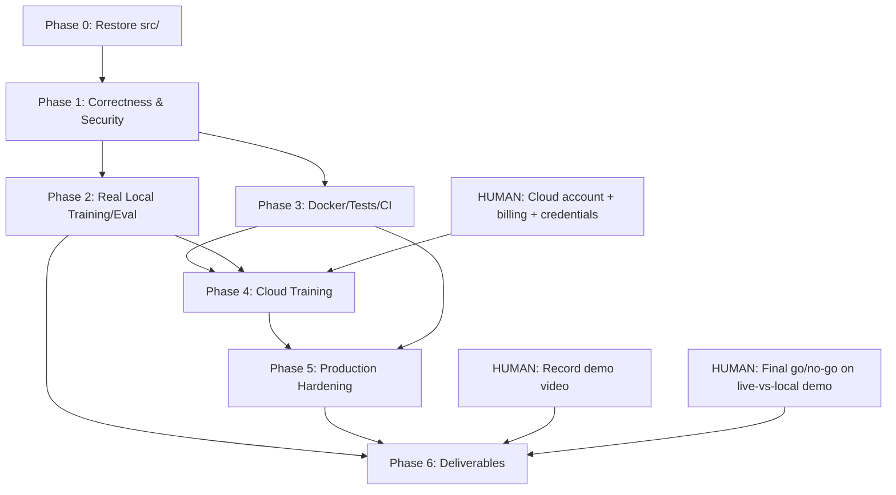

# SIH 26153 — Implementation Plan

**Source:** Synthesized from `docs/audit/00`–`13` (re-audit v2, 2026-09-23).
**Current Readiness Score:** 25/100. **Root cause:** the `src/` ML core (parser, world model, explainer, MITRE mapper) was deleted during the FastAPI/Next.js restructure, so the backend cannot start. On top of that, several real bugs exist in the code that *is* present (async blocking, broken evaluation, path traversal, no Dockerfiles/tests/CI).

This plan sequences the fix so the team ends up with: a working backend + frontend, a model trained on real (not just synthetic) data with honest metrics, a reproducible cloud training pipeline, and a demo that is safe to show air-gapped on judging day.

---

## 1. Guiding Principles

1. **Recover before you improve.** Nothing else matters until `uvicorn backend.main:app` boots and the frontend can talk to it end-to-end, even against a dummy/synthetic model.
2. **Fix correctness before cloud-scaling it.** Training a broken evaluation pipeline on a bigger AWS GPU just produces bigger fake numbers, faster. The labeling bug (`05`, `03`) and the benchmark self-comparison bug (`05`) must be fixed *before* any cloud training run is spent on it.
3. **Every task ends with a working full-stack verification**, not just "code compiles." The agent must prove — by actually starting both services and hitting the API/UI — that the system still works after each change. This is a hard requirement, not a nice-to-have (see `AGENT_TASKS.md` verification protocol).
4. **Separate what an agent can do from what only a human can do.** Cloud account creation, billing, credential issuance, recording a video, and go/no-go product decisions cannot be delegated to the coding agent. These are isolated into `HUMAN_TASKS.md` so they don't block or get silently skipped by the agent.
5. **Judging-day demo runs fully local/air-gapped** (per `13`, §10). Cloud is the *training control plane* only. Keep this framing consistent across code, docs, and pitch.

---

## 2. Target End State ("Definition of Done")

- [ ] Backend starts cleanly with no missing-module errors; `/docs` (OpenAPI) loads; `/healthz` reports model loaded.
- [ ] Frontend (`bun run dev` and `bun run build`) runs against the backend with no console errors; all 8 dashboard tabs render real (not crashed) data.
- [ ] Upload → Forecast → MITRE → XAI → Benchmark → SOC pipeline works end-to-end for both a CSV and a PCAP input, without freezing the server.
- [ ] No blocking I/O inside `async def` routes; large-file upload doesn't hang the whole API.
- [ ] Path traversal, CORS wildcard, and missing upload-size-limit issues are fixed.
- [ ] Model has been trained at least once on **real CIC-IDS-2018 data** (not only synthetic), with a correct label→risk mapping.
- [ ] Benchmark/evaluation no longer compares the model's predictions to themselves; F1/precision/recall/FPR are computed against real future ground truth, per horizon (F1@1..F1@K).
- [ ] World model beats (or is honestly reported as not beating) the logistic-regression baseline — either way, the number is real.
- [ ] Dockerfiles exist for backend and frontend; `docker-compose up` runs the full stack locally.
- [ ] Minimal automated tests exist and pass (`pytest`, `httpx` TestClient) for the parser, model forward pass, and each API route.
- [ ] Cloud training pipeline (`train_cloud.sh`/`.py`) runs on an AWS/GCP VM, reads data from S3/GCS, writes weights+metrics+scaler back to S3/GCS with a timestamped/commit-hashed release folder.
- [ ] Backend can load "latest" model release from S3/GCS at startup (or from a local path for the offline demo build).
- [ ] LICENSE, rewritten README, architecture doc, demo video, and slide deck exist (deliverables R21–R26).
- [ ] Final local, offline, `docker-compose`-based demo run is verified stable end-to-end.

---

## 3. Phased Roadmap

### Phase 0 — Recovery (must finish before anything else)
Restore the deleted `src/` core and get the two services talking to each other again, even with known bugs still present. Goal: **unblock**, not fix everything.

### Phase 1 — Correctness & Security Fixes
Fix the async event-loop blocking, path traversal, CORS, upload limits, label-engineering bug, and the self-comparison evaluation bug. These are all local, no cloud needed, and must be correct before spending cloud compute/money.

### Phase 2 — Real Training & Honest Evaluation (local first)
Re-run training locally on real CIC-IDS-2018 data (or a subset) with the fixes from Phase 1, to prove the pipeline produces sane, non-zero, non-self-referential metrics before moving to the cloud.

### Phase 3 — Packaging & Infra
Dockerfiles, docker-compose, minimal tests, CI (lint/test/build). This is what makes Phase 4 (cloud) reproducible instead of another one-off script.

### Phase 4 — Cloud Training Pipeline
Stand up the S3/GCS layout, the cloud training script, and run a full training pass on the complete (or a larger) dataset on an AWS/GCP GPU VM. Push the artifact back with versioning.

### Phase 5 — Production Hardening
Rate limiting, secrets management, upload job/status pattern (background task + polling or SSE) instead of a blocking request, OpenAPI-generated frontend types, structured logging.

### Phase 6 — Deliverables & Demo
README, architecture doc, LICENSE, slide deck, demo video, and a final rehearsed offline demo run.

> Human-only items (cloud account/billing, credential issuance, recording, final go/no-go, judging-day logistics) are interleaved into these phases but tracked separately in `HUMAN_TASKS.md` so the agent doesn't block waiting on them and doesn't attempt them itself.

---

## 4. Dependency Map (what blocks what)

---

## 5. How to Use the Other Two Documents

- **`AGENT_TASKS.md`** — hand this to your coding agent. It is an ordered checklist, one task at a time, each with explicit acceptance criteria and a **mandatory verification step** (start backend, start frontend, hit real endpoints, confirm no crash/regression) before the agent may mark the task done or move to the next one.
- **`HUMAN_TASKS.md`** — things the agent must not attempt: cloud account/billing setup, IAM/credential issuance, buying a GPU quota increase, recording/editing the demo video, and product decisions (e.g., AWS vs GCP, live-cloud-demo vs local-only demo). Do these in parallel with the agent's Phase 0–3 work so Phase 4 isn't blocked when it's reached.

## 6. Recommended Sequencing (Hackathon Timeline)

| Day | Agent focus | Human focus (parallel) |
|---|---|---|
| Day 1 AM | Phase 0 (restore `src/`, boot both services) | Decide AWS vs GCP; create cloud account/billing alert |
| Day 1 PM | Phase 1 (correctness/security fixes) | Issue IAM user/service account + keys for the agent's CI config (agent never creates the account itself) |
| Day 2 AM | Phase 2 (local real-data training/eval) | Provision the training VM / request GPU quota if needed |
| Day 2 PM | Phase 3 (Docker/tests/CI) → Phase 4 (cloud training kicked off) | Monitor cloud spend; sanity-check training VM is up |
| Day 3 AM | Phase 5 (hardening) while cloud training runs/finishes | Download final trained weights from S3/GCS to a laptop for the offline demo |
| Day 3 PM | Phase 6 (README/arch doc/slides scaffolding) + final local demo rehearsal with agent | Record the 2-minute demo video; finalize 5-slide deck; go/no-go call |
